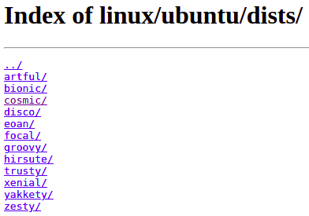
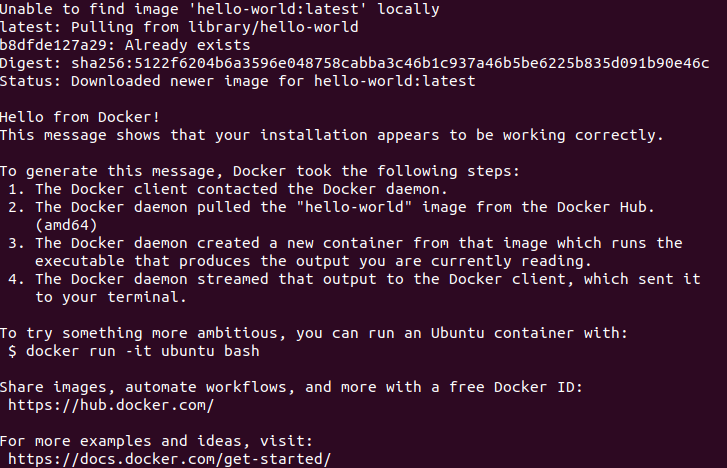
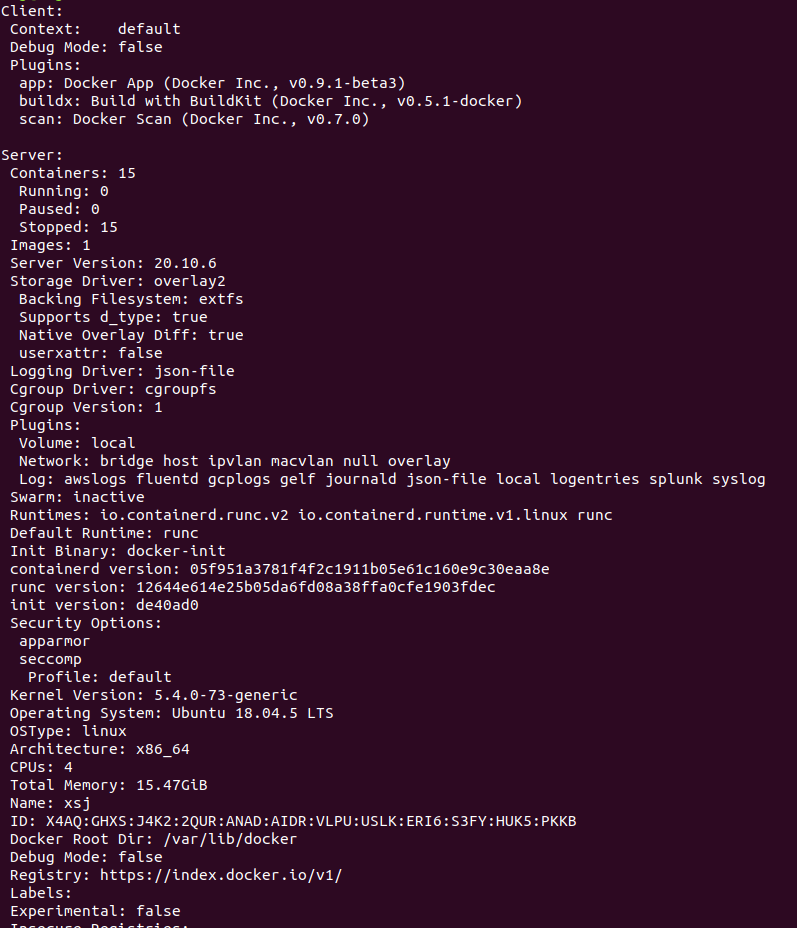
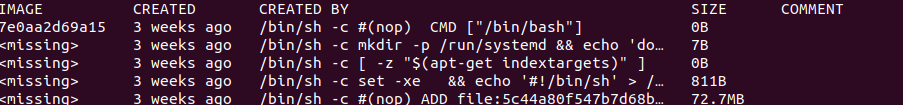
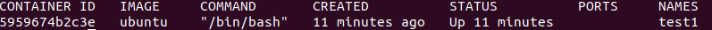
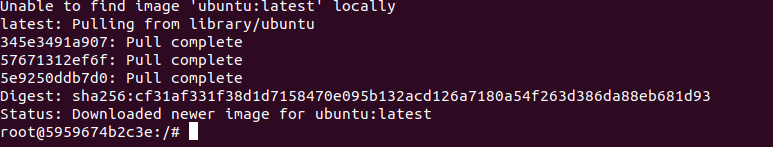
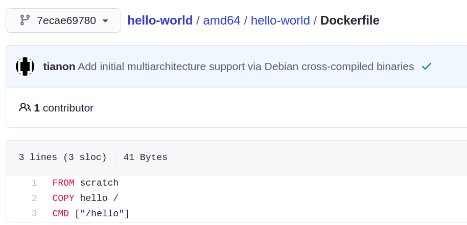

# Docker 学习笔记

内网环境下安装工作相关软件简直让人抓狂，网上有人推荐使用docker， 之前一直有听说，但一直没有勇气下手。这次被逼上绝路，实在忍无可忍，开始了学习之旅。学习的过程中意识到这个还能解决一个痛点：深度学习环境配置。每次我们换一个电脑或者工作环境，总需要耗费很多时间去配置环境，且不同的电脑硬件和系统状态不一致，会产生很多意想不到的问题。有了“类虚拟机”的docker，我们不就可以轻松实现环境的移植和使用了么。

## Docker简介

### 基本概念

> Docker 是一个[开源](https://baike.baidu.com/item/开源/20720669)的应用容器引擎，让开发者可以打包他们的应用以及依赖包到一个可移植的[镜像](https://baike.baidu.com/item/镜像/1574)中，然后发布到任何流行的 [Linux](https://baike.baidu.com/item/Linux)或[Windows](https://baike.baidu.com/item/Windows/165458) 机器上，也可以实现[虚拟化](https://baike.baidu.com/item/虚拟化/547949)。容器是完全使用[沙箱](https://baike.baidu.com/item/沙箱/393318)机制，相互之间不会有任何接口。

以上是百度百科对Docker的定义，术语比较多，难以理解。站在当前认知的基础上，我认为Docker 可以理解为一个简洁版的虚拟系统，通过镜像能将我们需要的环境进行打包发布和加载使用。

### 常用术语

- 镜像： 是包含一系列应用环境的或者软件的包，类比C++中的概念，还可以将其理解成一个类，这个镜像（类）中具有各种软件环境（属性）和相关功能（方法）；docker中的镜像是通过层的叠加生成的，其背后是一条条的文件指令进行叠加
- 容器：可以理解为由镜像产生的一个应用实例，类比C++的概念，可以想成这是镜像产生的一个对象；

## Docker 安装

### Docker 安装方法

Docker的安装比较简单，照着官网的说明安装基本没有什么坑： https://docs.docker.com/engine/install/ubuntu/

需要说明三点：

>1. 在线安装时可以更换为国内的源，比如阿里源，可以参考https://www.cnblogs.com/baylorqu/p/12301270.html
>2. 对于没有外网权限的情况，可以参考” [install it manually](https://docs.docker.com/engine/install/ubuntu/#install-from-a-package)“部分,下载docker安装文件时需要注意自己的系统版本，以及对应的CPU架构，intel电脑一般使用amd64：
>   - Ubuntu Hirsute 21.04
>   - Ubuntu Groovy 20.10
>   - Ubuntu Focal 20.04 (LTS)
>   - Ubuntu Bionic 18.04 (LTS)
>   - Ubuntu Xenial 16.04 (LTS)
>3. 需要下载三个文件，分别是containerd, docker-ce-cli 和 docker-ce， 安装这三个文件时有先后顺序，如果顺序错误，直接提示先安装缺失的文件；



### 

#### 在线模式

对于在线安装的情况比较简单，直接：

```shell
sudo docker run hello-world #该命令是运行hello-world这个镜像
```



docker会先尝试在本地找hello-world这个镜像，如果没有找到，就会联网到docker-hub（类似于github）上去找这个镜像，然后运行。当我们看到hello from Docker时，基本可以确认Docker安装成功；

#### 离线模式

对于离线模式，没法联网去下载hello-world镜像，可以两种方式，一是另外一台可联网的电脑到docker hub上手动下载hello-world镜像的Dockerfile文件然后进行编译生成相应的镜像；二是直接查看docker的信息确认是否安装好：

``` shell
sudo docker info # 查看本机的docker信息
```

如果能看到Client和Server证明服务端和客户端已经建立，基本可以确认本机上的docker安装成功；




## 基本命令

完成了docker的安装，一些基本的命令行需要会使用：

### 镜像命令

```shell
docker images	#查看本机上所有镜像
docker search + 镜像名称 #联网在docker-hub上搜索镜像
docker pull + 镜像名称 #在docker-hub上下载镜像
docker rmi -f 镜像ID/镜像名 #删除镜像
docker rmi -f $(docker images -aq) #删除全部镜像
```

### 容器命令

有了镜像之后，我们就可以创建容器。（有了类之后，我们就可以创建对象)

**新建容器并启动**

```shell
docker run [可选参数] imagename
	--name ="Name"
	-d 		#以后台方式运行
	-i
	-t		# 和i一起配合xinx使用，是以交互方式运行，进入容器访问内容；
	-p/P	# 指定容器端口,可以通过网络对容器进行访问；
```

比如交互模式创建一个名称为test1的容器，该容器基于ubuntu镜像：

```shell
sudo docker run -it --name="test1" ubuntu /bin/bash
```




我们看到一个Names 为test1的容器已经运行，容器的ID为5959674b2c3e. 系统首先还是在本地查找是否有该镜像，如果没有直接去docker-hub去下载，然后直接运行。

**退出容器**

```shell
exit	# 退出容器
ctrl + P +Q		#不停止容器，退出界面
```

**列出所有运行程序**

```shell
docker ps 	# 查看正在运行的容器
docker ps -a	# 查看最近运行过的容器，并带出历史上运行过的程序
docker ps -n=个数	#显示一定个数的容器
```

**删除容器**

```shell
docker	rm 容器id		#删除指定容器
docker rm -f $(docker ps -aq)	#删除全部容器
```

**启动和停止容器**

```shell
docker start 容器id 	#启动容器
docker restart 容器id		#重启
docker stop 容器id	#停止某个容器
docker kill 容器id	#杀掉(强制)某个容器
```

### 其他命令

```shell
docker run -d 镜像名称  # 后台启动容器，不带交互界面
docker top	容器id	#查看进程信息
docker exec -it 容器id /bin/bash  #进入正在运行的容器，开启新的终端，并在里面进行操作
docker attach 容器id #进入正在运行的容器，并直接进入到正在执行的终端，不会启动新的进程
docker cp 容器id：容器内路径 目的地主机路径	#从容器内拷文件到主机	
docker history 镜像名称		# 查看镜像的构成
```


上图是运行docker history ubuntu得到的结果，通过这个命令可以看到，ubuntu这个镜像是5条指令生成的。当我们拿到一个新的镜像时，如果想逆向查看其拥有的功能就可以使用这条命令。但会发现，很多命令 没法完全展示出来，此时可在命令后传入参数，查看完整的history信息：

```shell
docker history 镜像名称 --no-rreuc=true
```

## 生成镜像

容器制作镜像有两种方式，一是在已有的镜像基础上，利用运行的container，进行commit生成镜像；二是使用DockerFile命令构建镜像

### commit镜像

```shell
# 命令和git原理类似
docker commit -m="提交的描述信息" -a=”作者“ 容器id 目标镜像名：[tag]
```

docker commit 会提交容器成为一个新的副本。需要注意的是，这里需要联网，commit会将此镜像上传到docker-hub上

### dockerfile

Dockerfile就是用来构建docker镜像的构建文件，是一个命令行的参数脚本。

**构建步骤**：

1、编写一个dockerfile文件

2、docker build构建一个镜像

3、docker run 运行镜像

4、docker push 发布镜像（Docker-hub、阿里云镜像仓库）

**Dockerfile基础知识**

1、每个指令（关键字）都必须是大写字母；

2、按从上到下的顺序进行执行；

3、#表示注释

4、每个指令都会创建提交一个新的镜像层，并提交


**Dockerfile指令**

```shell
FROM				# 基础镜像，一切从这里开始构建
MAINTAIN			# 镜像是谁写的，姓名+邮箱
RUN					# 镜像构建的时候需要运行的命令
ADD					# 步骤，添加压缩包，会自动解压
WORKDIR				# 镜像的工作目录
VOLUME				# 挂载的目录
EXPOSE				# 保留端口配置
CMD					# 指定这个容器启动的时候要运行的命令，只有最后一个会生效，可被替代
ENTRYPOINT			# 指定这个容器启动的时候要运行的命令，可以追加命令
ONBUILD				# 当构建一个被继承dockerfile，这个时候就会运行ONBUILD的指令，触发指令
COPY				# 类似与add，将文件拷贝到镜像中
ENY					# 构建的时候设置环境变量

```



上图为hello-world的Dockerfile文件，通过这个文件就构建出了我们装dock时使用的hello-world镜像，镜像是一层一层的，脚本是一行一行的命令，每个命令都是一层。

```shell
# 创建的dockerfile文件，名字可以随便取，但是建议使用Dockerfile作为文件名

# 文件中的内容格式 指令（全大写） 	参数

FROM scratch	# 以XXX镜像作为起点进行构建，这里的scratch是一个很基础的镜像包，很多官方的镜像包都可以作为基础包搭建自己的镜像
COPY hello /	# 拷贝hello这个文件
CMD ["/hello"]	# 运行hello这个文件

# 这里的每个命令，就是镜像的一层
```

## 使用镜像

生成的镜像文件，一方面我们可以通过docker commit上传到docker hub，另一方面可以使用docker save进行打包。对于上传到docker-hub的镜像，我们可以直接采用docker pull或docker run的方式直接使用；对于自己生成的镜像，我们可采用docker load进行加载；

```shell
docker save 镜像id/镜像名  # 会将镜像打包成一个tar文件
docker load tar文件   # 加载镜像，不能对载入的镜像重命名

区别：
docker export 容器ID/容器名	#保存容器，形成镜像
docker import tar文件	# 加载由容器形成的镜像，可以为镜像制定新名称
```


## 容器的通讯


## 在docker中集成QtCreator


## TBD

1.  镜像的叠加，sodo apt-get update会报错；
2. 在QTCreator的基础上叠加opecv出错；
3. 看有的文章说一个容器中尽量不要使用两个进程，为什么？如何解决需要同时运行两个进程的需求：比如在QtCreator中需要运行opencv；


